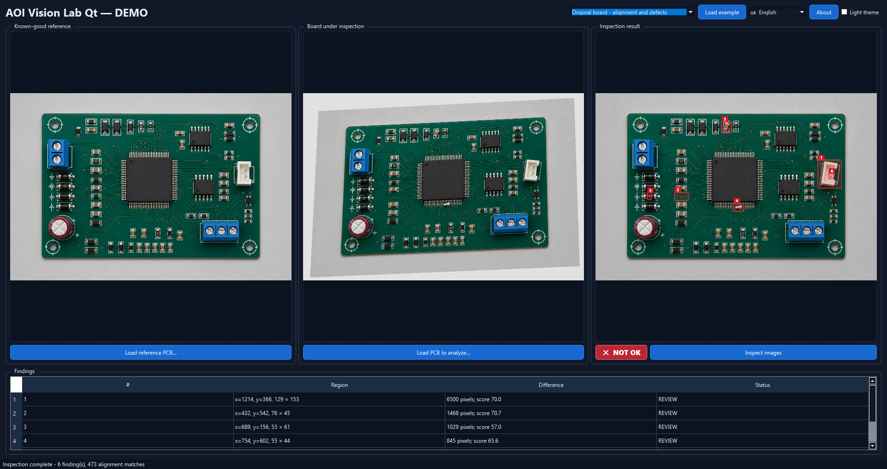
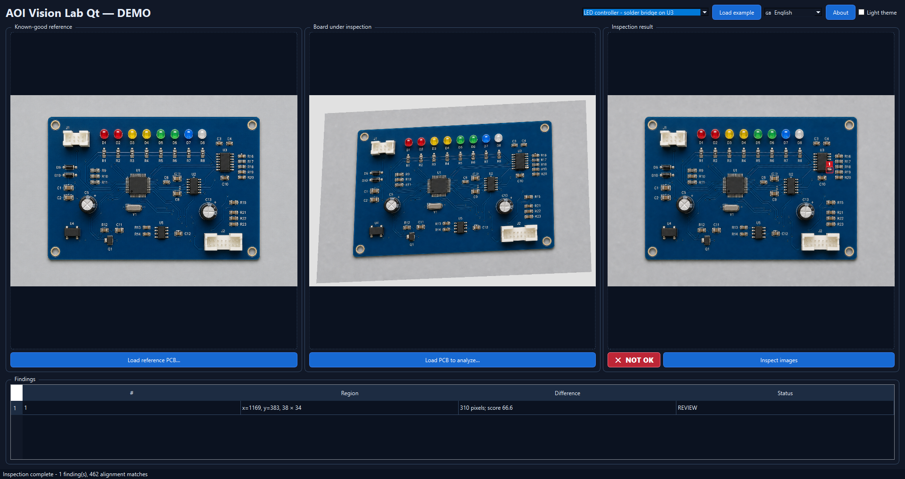

# AOI Vision Lab Qt

Desktop demonstration of image registration and visual difference detection for
automated optical inspection concepts.

The public project is intended as a technical portfolio demonstration. It is not
a production inspection system and must not be used to certify manufactured parts.

## Screenshots

### Geometric alignment and multiple findings



### Localized solder-bridge detection



## Current state

- Qt 6 / C++17 project that opens directly in Qt Creator.
- Responsive three-panel interface.
- Reference and inspection image loading.
- Light and dark themes.
- OpenCV registration, perspective correction and defect-region extraction.

## OpenCV dependency

OpenCV is declared in `vcpkg.json` and built for the same MinGW toolchain as
Qt. From the project directory, install or restore it with:

```powershell
$env:PATH = "C:\Qt\Tools\mingw1310_64\bin;C:\Qt\Tools\Ninja;" + $env:PATH
C:\vcpkg\vcpkg.exe install --triplet x64-mingw-dynamic
```

## Open in Qt Creator

Open `AOIVisionLabQt.pro`, select the Desktop Qt 6 MinGW 64-bit kit and build.
## AI and MCP automation

The graphical application and external automation share the same C++/OpenCV
inspection engine. A board can be inspected without opening the interface:

```powershell
AOIVisionLabQt.exe --reference reference.png --inspect candidate.png `
  --report result.json --visualization marked-result.png
```

`automation/aoi_mcp_server.py` exposes this operation as the local MCP tool
`analyze_board`. It accepts absolute paths for the reference and candidate,
returns structured JSON and can save both the report and marked image. The
server uses standard input/output, has no Python package dependencies and does
not upload production images to any external service. A client configuration
example is included in `automation/mcp-config-example.json`.

## Windows SmartScreen and file verification

The portable executable is currently unsigned, so Windows SmartScreen may show
a warning on first launch. Download releases only from this repository and
compare the ZIP's SHA-256 value with the digest published in the release notes:

```powershell
Get-FileHash .\AOIVisionLabQt-0.1.0-Windows-x64.zip -Algorithm SHA256
```

---

# AOI Vision Lab Qt — Español

Demostración de escritorio del registro de imágenes y la detección de
diferencias visuales aplicada a conceptos de inspección óptica automatizada.

El proyecto sirve como demostración técnica y de portfolio. No es un sistema
de inspección de producción y no debe utilizarse para certificar piezas
fabricadas.

## Capturas de pantalla

### Alineación geométrica y varios hallazgos


### Detección localizada de un puente de soldadura


## Estado actual

- Proyecto Qt 6 / C++17 que se abre directamente en Qt Creator.
- Interfaz adaptable con tres paneles.
- Carga de una PCB de referencia y otra PCB para analizar.
- Temas claro y oscuro.
- Registro mediante OpenCV, corrección de perspectiva y extracción de regiones defectuosas.

## Dependencia de OpenCV

OpenCV está declarado en `vcpkg.json` y se compila con la misma cadena de
herramientas MinGW utilizada por Qt. Desde el directorio del proyecto puede
instalarse o restaurarse mediante:

```powershell
$env:PATH = "C:\Qt\Tools\mingw1310_64\bin;C:\Qt\Tools\Ninja;" + $env:PATH
C:\vcpkg\vcpkg.exe install --triplet x64-mingw-dynamic
```

## Abrir en Qt Creator

Abre `AOIVisionLabQt.pro`, selecciona el kit Desktop Qt 6 MinGW de 64 bits y
compila el proyecto.

## Automatización mediante IA y MCP

La interfaz gráfica y la automatización externa comparten el mismo motor de
inspección C++/OpenCV. Puede analizarse una placa sin abrir la interfaz:

```powershell
AOIVisionLabQt.exe --reference referencia.png --inspect candidata.png `
  --report resultado.json --visualization resultado-marcado.png
```

`automation/aoi_mcp_server.py` publica esta operación como la herramienta MCP
local `analyze_board`. Recibe las rutas absolutas de la referencia y la placa
candidata, devuelve datos JSON estructurados y puede guardar tanto el informe
como la imagen marcada. El servidor utiliza la entrada y salida estándar, no
requiere paquetes adicionales de Python y no envía las imágenes de producción
a ningún servicio externo. Se incluye una configuración de cliente en
`automation/mcp-config-example.json`.

## Windows SmartScreen y verificación del archivo

El ejecutable portable todavía no está firmado, por lo que Windows SmartScreen
puede mostrar una advertencia durante el primer arranque. Descarga las versiones
únicamente desde este repositorio y compara el SHA-256 del ZIP con el publicado
en las notas de la versión:

```powershell
Get-FileHash .\AOIVisionLabQt-0.1.0-Windows-x64.zip -Algorithm SHA256
```
